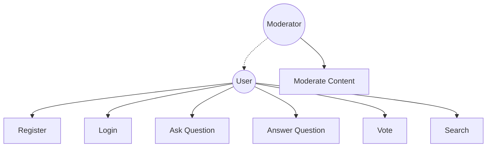
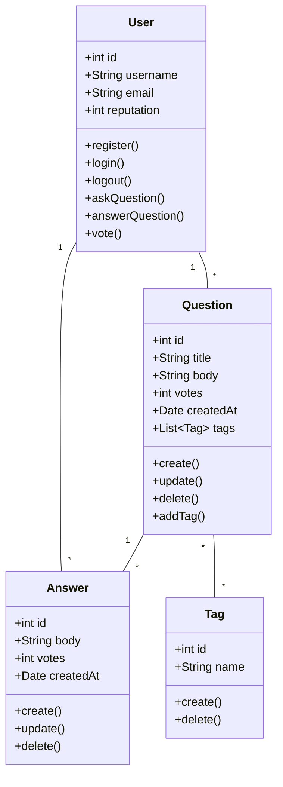
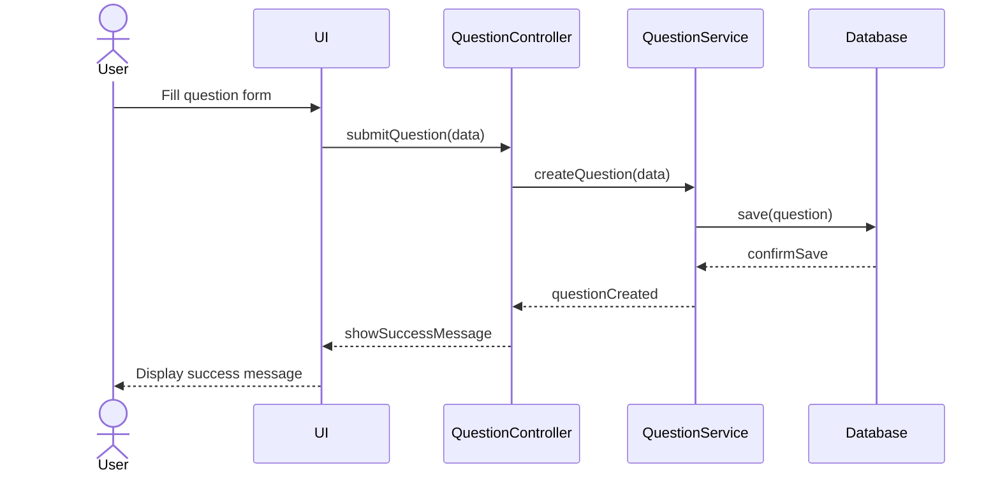
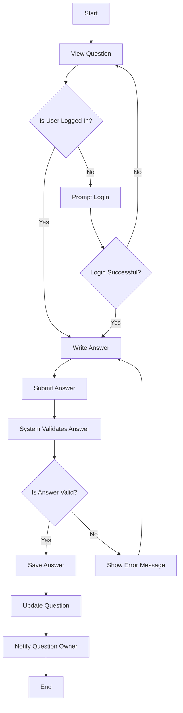

```md
# Designing Stack Overflow: A Comprehensive Tutorial

## Table of Contents
1. [Introduction](#introduction)
2. [Requirements Analysis](#requirements-analysis)
3. [Use Case Diagram](#use-case-diagram)
4. [Class Diagram](#class-diagram)
5. [Sequence Diagram](#sequence-diagram)
6. [Activity Diagram](#activity-diagram)
7. [Implementation Code](#implementation-code)
8. [Conclusion](#conclusion)

## 1. Introduction
In this tutorial, we'll walk through the process of designing a system similar to Stack Overflow, a popular question-and-answer platform for programmers. We'll cover various aspects of software design, including requirements analysis, use case modeling, class diagrams, sequence diagrams, activity diagrams, and finally, we'll look at some implementation code.

## 2. Requirements Analysis
Let's start by defining the key requirements for our Stack Overflow-like system:

### User Registration and Authentication
- Users should be able to register, log in, and log out
- Users should have profiles with basic information

### Question Functionality
- Users should be able to ask questions
- Questions should have titles, bodies, and tags
- Users should be able to view questions

### Answer Functionality
- Users should be able to post answers to questions
- Answers should be associated with specific questions

### Voting System
- Users should be able to upvote or downvote questions and answers

### Reputation System
- Users should earn reputation points based on their contributions

### Search Functionality
- Users should be able to search for questions using keywords or tags

### Moderation
- Certain users with high reputation should have moderation privileges

## 3. Use Case Diagram
A use case diagram helps visualize the main functionalities of the system and how users interact with them. Here's a simplified use case diagram for our Stack Overflow-like system:



This diagram shows the main actions that regular users and moderators can perform in the system.

## 4. Class Diagram
A class diagram represents the structure of the system, showing the classes, their attributes, methods, and relationships. Here's a simplified class diagram for our Stack Overflow-like system:



This class diagram shows the main entities in our system and how they relate to each other.

## 5. Sequence Diagram
A sequence diagram illustrates how objects in the system interact over time for a particular scenario. Let's create a sequence diagram for the process of asking a question:



This diagram shows the sequence of interactions when a user asks a question, from the user interface through to the database and back.

## 6. Activity Diagram
An activity diagram represents the flow of activities in a system. Let's create an activity diagram for the process of answering a question:



This activity diagram illustrates the process flow when a user attempts to answer a question, including login checks and validation steps.

## 7. Implementation Code

(Here you can insert the code examples and explanations for the implementation.)

## 8. Conclusion

```
